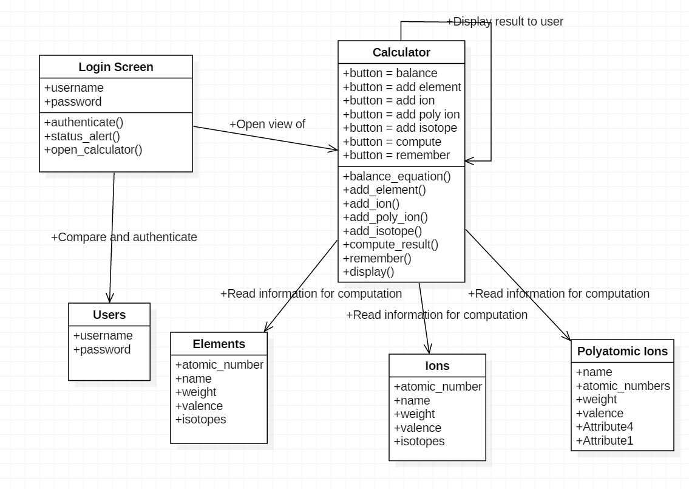

##Chemistry Analysis

The goal of this project is to determine the results of chemical reactions based on elements/chemicals provided as input by a user. 

To that end, the webpage will have a graphical user interface that will allow a user to click buttons representing various elements and common isotopes, ions, and polyatomic ions of particular interest, that will then be selected from predefined data set and run through an algorithm that will then determine the resultant chemical. 

The user will have access to the gui with its listing of elements and its computational operations. The gui will be linked to the dataset and algorithm to do the desired work "behind the scenes," which will then update the gui with the results of the action for the user to see and determine how they then wish to proceed with the information thus provided to them. 

